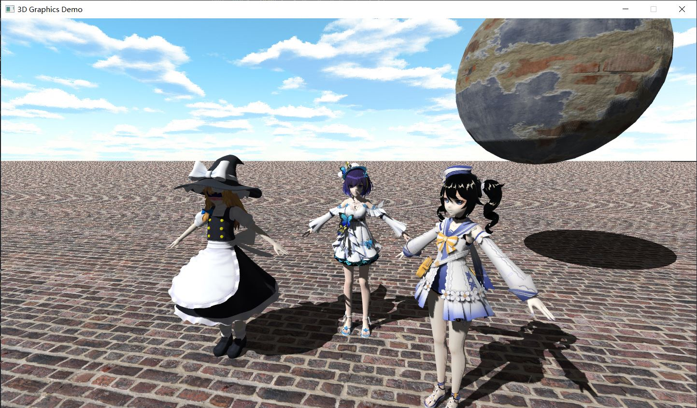

# Simple Vulkan Renderer - Rust
My simple renderer in rust based on vulkan, aiming at learning vulkan and 3D rendering.

## Crates
+ `ushio-geom` 3D Math.
+ `ushio` Renderer and simple scene graph, including a glTF2.0 loader.
+ `rushio` example main logic.

## Main Dependencies
+ [`ash`](https://github.com/MaikKlein/ash) Vulkan bindings for Rust.
+ [`winit`](https://github.com/rust-windowing/winit) Cross-platform window creation and management in Rust.

## Features
+ Y-up right hand coordinates.
+ Transformation represented by translation, rotation (quaternion) and scale.
+ Phong pipeline based on vulkan and glsl.
+ Skybox
+ Simple shadow mapping
+ Normal map (Need to fix)
+ Render frames in flight
+ glTF2.0 loader
+ Node, mesh and material definitions inspired by glTF2.0

## Screenshot

<b>NOTE</b>: Used assets are <b>not</b> included in this repo.
